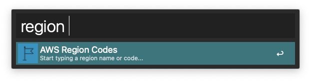
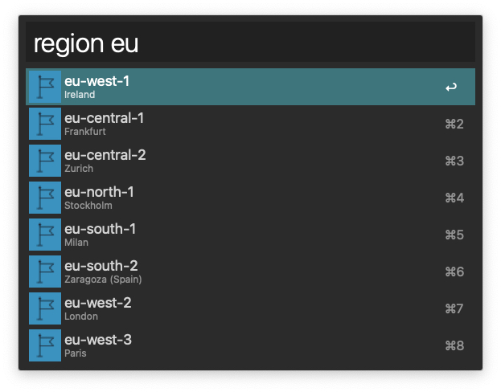

# AWS Region code

You can view AWS regions alias and copy the code to clipboard.

Text search method : substring match

[AWS Region code](https://docs.aws.amazon.com/general/latest/gr/rande.html)

[Download Alfred workflow](http://www.packal.org/workflow/aws-region-codes)

## example

1. type `region`

2. type `region eu`

3. type `region south`

## Credits

Credit to https://github.com/elbanic/alfred.awsregion for the original version of this workflow.
As of v2.0 I have upgraded it to Python3 and updated the region list as of March 2023
